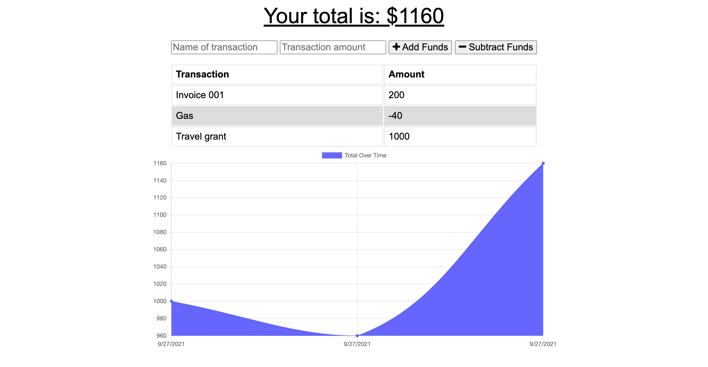

# Budget Tracker

## Description
An application that permits users to track withdrawals and deposits with or without an internet connection.

## Table of Contents
- [Screenshot](#screenshot)
- [Usage](#usage)
- [Credits](#credits)
- [License](#license)
- [Features](#features)
- [Questions, Comments, Suggestions](#questions-comments-suggestions)

## Screenshot

## Usage
Enter the name of a transaction in the field provided, followed by a transaction amount in the adjacent field. Then, if this transaction is a deposit, click the "Add Funds" button. Otherwise, click the "Subtract Funds" button. 

To test the offline functionality, open the Network tab in Chrome DevTools and set the connection to "Offline." Then perform the aforementioned tasks before returning the connection in the Network tab to "No throttling." The application will then reconnect to the database and save transactions craeted while the app was offline.

 ## Features
 - HTML
 - CSS
 - JavaScript
 - Compression
 - Express.js
 - Mongoose
 - MongoDB
 - Morgan

## License
This application is covered under the MIT license.

## Credits
### Developed By
- [Ryan R. Campbell](https://www.github.com/rrcampbell-exe/)

## Questions, Comments, Suggestions
Please email [Ryan R. Campbell](mailto:campbell.ryan.r@gmail.com) with any questions, to report any bugs, or to make any feature suggestions. You can also [contact Ryan R. Campbell on GitHub](https://www.github.com/rrcampbell-exe/).

This README was generated by [Ryan R. Campbell's](https://www.github.com/rrcampbell-exe/) [README Generator](https://github.com/rrcampbell-exe/readme-generator).